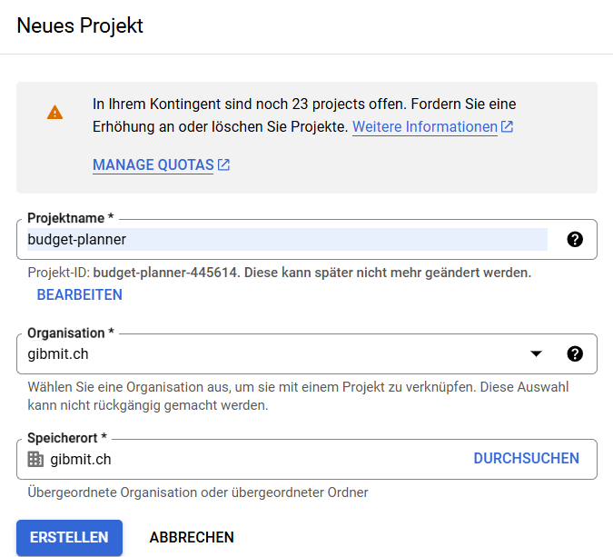
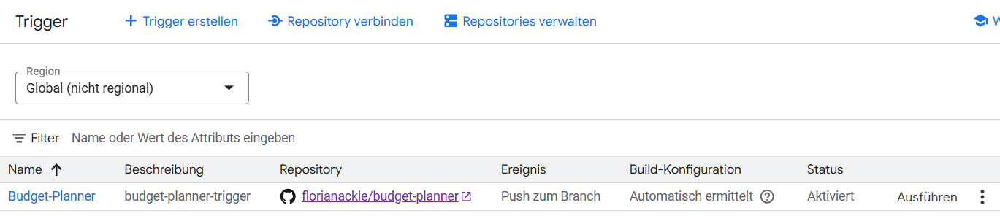
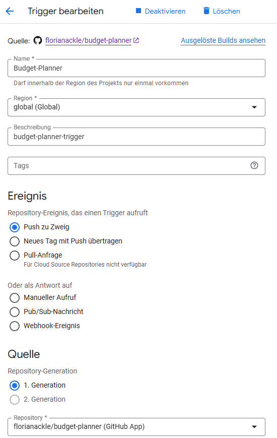
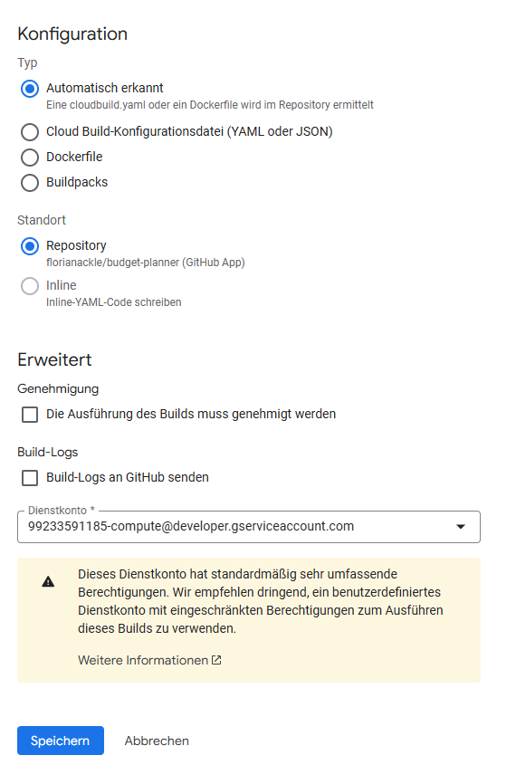
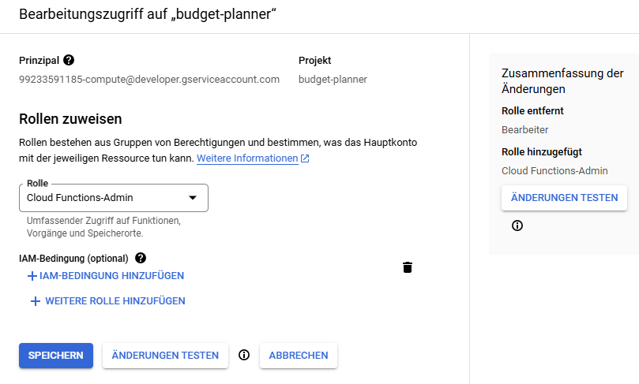
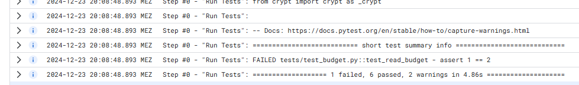
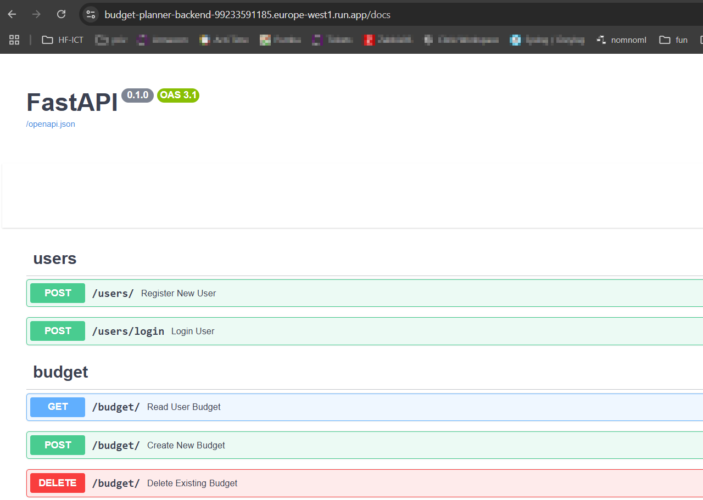

---

## 1. Einleitung

In dieser Anleitung wird beschrieben, wie die Budget-Planner-App mithilfe von Google Cloud Build und Cloud Run bereitgestellt werden kann. 
Ziel ist die Automatisierung von Build- und Deployment-Prozessen, um eine stabile und skalierbare Lösung zu ermöglichen. 

---

## 2. Vorbereitung und Voraussetzungen

- **Google Cloud Konto:** Stelle sicher, dass du ein aktives Konto hast.  
- **GitHub Repository:** Der Budget-Planner muss in einem deiner GitHub-Repositories vorliegen.  

---

## 3. Google Cloud Projekt erstellen

1. Öffne die [Google Cloud Console](https://console.cloud.google.com).  
2. Navigiere zu **"Projektübersicht"** und erstelle ein neues Projekt, z. B. `budget-planner`.  


---

## 4. Repository mit Google Cloud Build verbinden

1. Gehe in der Google Cloud Console zu **"Cloud Build" → "Trigger"**.  
2. Klicke auf **"Trigger hinzufügen"** und wähle **"GitHub"** als Quelle aus.  
3. Autorisiere Google Cloud für den Zugriff auf dein GitHub-Konto.  
4. Wähle dein Repository aus und bestätige die Verbindung.  

---

## 5. CI/CD-Pipeline mit Cloud Build Trigger einrichten

1. Erstelle einen neuen Trigger:  
   - **Name:** `budget-planner`
   - **Region:** `global`  
   - **Ereignis:** Push zu Zweig (z. B. `main` oder `.*` für alle Branches)
   - **Generation:** `1. Generation`
   - **Konfiguration:** Automatisch --> `cloudbuild.yaml`.
   - **Standort:** `Repository`
  
2. Speichere den Trigger und aktiviere ihn.





---

## 6. Konfigurationsdateien vorbereiten

### `Dockerfile`  
Im Dockerfile wird definiert, wie das Backend containerisiert wird.
1. Poetry installieren und Pakete aus dem Projekt in ein requirements.txt exportieren
2. Benötigte Pakete installieren
3. Entrypoint festlegen und Port 8000 Exposen

```dockerfile
FROM python:3.12-slim AS builder
WORKDIR /tmp
RUN pip install poetry
COPY ./backend/pyproject.toml ./backend/poetry.lock ./
RUN poetry export -f requirements.txt --output requirements.txt --without-hashes

FROM python:3.12-slim
WORKDIR /app
COPY --from=builder /tmp/requirements.txt .
RUN pip install -r requirements.txt
RUN rm requirements.txt
COPY ./backend/app /app
ENTRYPOINT ["fastapi", "run", "main.py"]
EXPOSE 8000
```

### `cloudbuild.yaml`  
In der Cloudbuild.yaml werden folgende Steps definiert:
1. Run Tests --> Ausführen von automatisierten Tests bei jedem Build
2. Build Docker Image --> Container builden mit neuer COMMIT_SHA
3. Push Docker Image --> Pushen des neuen Docker Images auf die Google Artifactory
4. Deploy Cloud Run --> Container Instanzen hochfahren und Port exposen

```yaml
steps:
  - id: "Run Tests"
    name: python:3.12-slim
    entrypoint: bash
    args:
      - "-c"
      - "cd backend && pip install poetry && poetry install && poetry run pytest"

  - id: "Build Docker Image"
    name: "gcr.io/cloud-builders/docker"
    args: ["build", "-t", "gcr.io/$PROJECT_ID/$REPO_NAME:$COMMIT_SHA", "."]

  - id: "Push Docker Image"
    name: "gcr.io/cloud-builders/docker"
    args: ["push", "gcr.io/$PROJECT_ID/$REPO_NAME:$COMMIT_SHA"]

  - id: "Deploy Cloud Run"
    name: "gcr.io/cloud-builders/gcloud"
    args:
      [
        "run",
        "deploy",
        "budget-planner-backend",
        "--min-instances",
        "0",
        "--max-instances",
        "1",
        "--image",
        "gcr.io/$PROJECT_ID/$REPO_NAME:$COMMIT_SHA",
        "--region",
        "europe-west1",
        "--allow-unauthenticated",
        "--port",
        "8000",
      ]

images:
  - "gcr.io/$PROJECT_ID/$REPO_NAME:$COMMIT_SHA"

options:
  logging: CLOUD_LOGGING_ONLY
```

---

## 7. IAM Berechtigungen konfigurieren

Damit das zuvor beim Cloud Build Trigger eingestellte Dienstkonto Cloud Run Funktionen ausführen darf, müssen dem Konto Berechtigungen erteilt werden.
Suche in der Google Cloud Konsole dazu nach **IAM** und füge deinem Dienstkonto die Rolle **Cloud Functions Admin** hinzu. 


---

## 9. Projekt deployen und testen

Nachdem die IAM-Settings gemacht wurden und die Konfiguration-Files (`cloudbuild.yaml` und `Dockerfile`) gepusht sind, ist das Projekt erfolgreich deployed.
Bei Problemen kann der Status des Builds beziehungsweise die Fehlermeldung in der Google Cloud Console überprüft werden.
- **Build-Logs prüfen:** Gehe zu **Cloud Build → Logs**, um Details zu sehen.  
- **Cloud Run Logs:** Hier findest du Laufzeitfehler der Anwendung. 

Bei nicht erfolgreichen Unit-Tests, bricht der Google Cloud Build automatisch ab.
So wird verhindert, dass fehlerhafte Builds deployed werden.


Nach erfolgreichem Deployment ist die Applikation unter der bereitgestellten URL verfügbar.


---

## 10. Herausforderungen und Lösungen

Während der Implementierung gab es einige Herausforderungen.
Eine der grössten Schwierigkeiten bestand darin, dass das Projekt nicht direkt im Root-Verzeichnis, sondern im Unterverzeichnis `/backend` lag. 
Dies erschwerte die Konfiguration der Pfade sowohl in der `Dockerfile` als auch in der `cloudbuild.yaml`. 

Eine vollständige Trennung von Frontend und Backend Projekten wäre sinnvoller, da dies das unabhängige Deployment in der Cloud erleichtert. 

Zusätzlich gab es Probleme mit den IAM-Berechtigungen, da der Service Account anfangs keine Rechte hatte, Google Cloud Run Funktionen auszuführen. 
Nachdem die Berechtigungen korrekt gesetzt wurden, konnte der Service Account jedoch ohne weitere Einschränkungen arbeiten.

---
